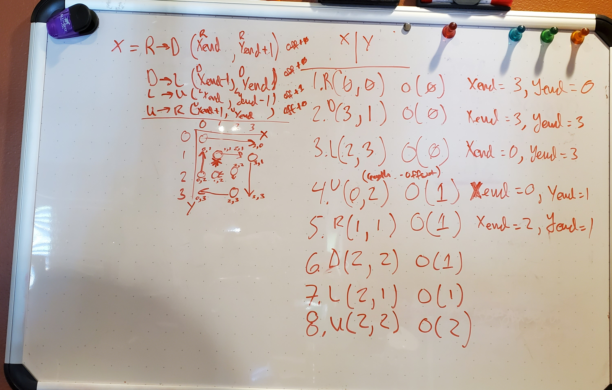

# Hello and Welcome
This readme is intended to explain thought process and solution to the following question...

```
Question 1
Write a function that, given a matrix of integers, builds a string with the entries of that matrix
appended in clockwise order.
String matrix(int[][] input)
For instance, the 3x4 matrix below:
2, 3, 4, 8
5, 7, 9, 12
1, 0, 6, 10
would make the string “2, 3, 4, 8, 12, 10, 6, 0, 1, 5, 7, 9”.
```

## Library Decisions
1. Spring & Spring Boot
   > Chosen for it's popularity as a common platform for simplifying development on JVM
2. Spring "Initializr" https://start.spring.io/
   > Chosen for it's ability quickly start a new java project with standard boiler-plate project structure, configuration and dependencies.
3. Maven
   > Chosen for it's popularity of library package management of JVM code bases.
4. Jupiter Junit
   > Chosen for it's popularity and my own personal familiarity as a unit testing framework.

## Tooling Decisions
1. VSCode
   > Chosen for it's freeness :)

## Style Guide
1. Based on Google Java Style guide lint file
   > I changed the 2 character indent to 8.

# High Level Approach Thinking
## What's the major challenge of the question?
Any time a problem requires managing multiple variables in combination it presents the challenge of correctly identifying the relationship between those variables. In this instance the primary variables with relationships are distance traveled through a direction of the two dimensional array. The next challenge is dealing with inconsistencies in the input data. Lets start by covering the foundational principles that I chose.
1. Principle-1 (P1): Least memory, least traversals.
2. Corelate-1 (C1): Given Principle-1, the algorithm must deal with any inconsistencies in a forgiving, consistent manner without the need for complete information ahead of time.

## Consequences of Principle-1 & Corelate-1
1. To satisfy both P1 & C1 I needed a single piece of knowledge about the 2D array, and that was max-width. I could accomplish this with one partial-traverse (max-width) and then a single full traversal.
2. During full traversal I used the max-width knowledge to inform replacement of "missing" integer values.
   > "missing" here is defined as: a null row, zero-length row, inconsistent-length row.
   > "replacement" here is defined as: a character value distinct from a numerical value.

**Alternatives:**
1. Filter all "missing" (as defined above) values. Consequences: extra traversals to discover all inconsistency types, extra memory to place only consistent value arrays, additional traversal to copy and arbitrary choice of what "consistent" means (ie. largest array, most common width, etc.)

# Javadocs
[index.html](target/site/apidocs/index.html)

# Development Chronicle
1. **Wednesday Sept 22nd**
   > 6:01 AM Pacific: Examined the question<p>
   > Tried to identify relevant concerns before starting<p>
   > I decided I was going to use Spring Boot and Initializr to get started quickly<p>
   > I knew that maintaining a relationship between horizontal and vertical travel was going to be key<p>
   > While taking a walk in my neighborhood I thought about the "offset" idea, that I might be able to carry through the execution and offset from the edges and increment that value as needed. <p>
   > While walking I thought a recursive solution might make sense as I knew that there were cycle patterns and contexts of state at each cycle of a pattern.<p>
   > No code written<p>
   > **Time spent:** less then an hour, I had other interviews this day.
2. **Thursday Sept 23rd**
   > I like to start any coding with unit tests first.<p>
   > I wrote the example use case provided in the PDF as the first test.<p>
   > I added 3 more cases, each dealing with null scenarios. <p>
   > I decided not to try and implement Generics as doing so would require complete traversal and boxing for primitive types and the question didn't ask for generic type support so doing so would be feature creep and implementation time increase.<p>
   > Coding progressed to get those 4 cases working starting with the simplest null tests.<p>
   > I started coding without a super clear path forward. I wanted to see how far a naive approach would get me. <p>
   > Right traversal was easy but then I had to start working out those relationships and see if there was a pattern on each cycle.
   >
   > I drew up an example case on my white board. KEY: O = offset, R = move-right, L, U, D = move-down..., </img><p>
   > Keeping all the variables straight turned out to be the hardest part.<p>
   > I eventually started to see a pattern which is shown in the upper left corner that appeared to repeat for each cycle.<p>
   > I didn't know how to stop traversing at this time but was confident it would be easy to determine once I started coding.<p>
   > I went back to coding with the basic 4 step pattern already figured out. So that flowed quickly.<p>
   > I was able to start debugging the two harder tests and was catching simple off-by-one and ><= mistakes.<p>
   > I stopped with L and D working with example test case.<p>
   > **Time spent:** 4-5 hours.
3. **Friday Sept 24th**
   > 6:50 AM Pacific: I started further debugging, fixing more of the simple off-by-ones and other simple issues.<p>
   > 8:30 AM Pacific: I had a working test case for the example provided in the question. <p>
   > 8:35 AM Pacific: I starting writing this chronicle to capture how/what I did since I knew the end was in sight. I still had to add more test cases, as knew there were permutations that would likely NPE or ArrayBounds fail and there was some cleanup.<p>
   > 9:12 AM Pacific: Back to the code for some refactoring before I add more test cases. <p>
   > Decided to remove `Arrays.stream(arrayToWalk, ..., ...).mapToObj(String::valueOf).collect(Collectors.joining(", "));` because only R traversal could use that approach. The other directions required traversal directions that aren't natively supported by the Stream API and would have required reversing order of a stream as it's own operation and creating new array/collections/streams to finally traverse. That's not very efficient and a for loop will do just fine.<p>
   > 10:00 AM Pacific: Finished converting `static` modifiers to normal object instance. This would allow for polymorphism and I can abstract the object creation out in the test cases.<p>
   > 10:10 AM Pacific: Deicide to use local git before I start adding more test cases and possibly making more radical changes. Git will allow rollbacks to known good state.<p>
   > 12:49 PM Pacific: Converted to parameterized tests as preparation for more test cases<p>
   > 14:26 PM Pacific: Fixed two array 2D test case, found a bug with last array null.<p>
   > 15:34 PM Pacific: Clean up.<p>
   > 16:06 PM Pacific: Calling it for the day.<p>
   > 16:10 PM Pacific: Realized I didn't deal with empty-array cases!
4. **Sunday Sept 25th**
   > Nothing
5. **Sunday Sept 26th**
   > 6:36 AM Pacific: Began addressing empty array cases.<p>
   > 7:45 AM Pacific: Finished empty array case fixes. <p>
   > 8:30 AM Pacific: Started adding broad approach documentation.<p>
6. **Monday Sept 27th**
   > 12:00 AM Pacific: Last minute documentation adds. Document the limits of changing direction of traversal and probably changing starting point as well.<p>
   > 13:00 PM Pacific: Javadocs generation and review + fixes to Javadocs.
